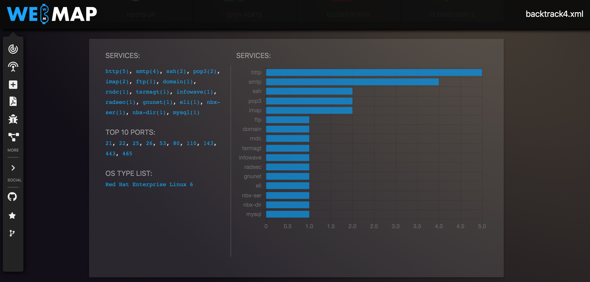

# Webmap Dashboard para Nmap

Compartiendo con unos colegas del grupo **Purple Team UTP** al cual pertenezco, hemos estado desarrollando una investigación sobre herramientas que podamos automatizar para la hora de realizar un pentesting, para ello hemos encontrado la herramienta Webmap, un dashboard que toma los resultados de Nmap y los gráfica, además que nos muestra un panel de administración. Esta herramienta no es recomendada en producción debido a que no cuenta con autenticación, sin embargo se pueden implementar medidas complementarias para permitir el acceso como una autenticación básica o una vpn. 

##### Requerimientos

* [VPS](https://www.vultr.com/?ref=8403796-6G "Vultr.com") o host con nmap 
* Docker instalado
* Equipo objetivo en nuestro caso será una máquina con un LMS llamado chamillo de nuestra empresa. 


1. Debemos crear un directorio de trabajo y luego escaneamos el objetivo con Nmap y lo guardamos en el directorio creado


```shell
nmap -sC -sV -T4 -vvvv -p- chamilo.ambientevirtualuea.org -oX /root/webmap-report/backtrack4.xml
```

2. Clonamos el repositorio de webmap 

```
git clone https://github.com/SabyasachiRana/WebMap.git
```


3. Vamos a iniciar el contenedor que tiene la aplicación web 


```shell
docker run -dit --name webmap -h webmap -p 8000:8000 -v /root/webmap-report:/opt/xml secureforest/webmap
```

4. Para acceder a la aplicación debemos obtener el token de autenticación como nos indica la aplicación


```shell
 docker exec -ti webmap /root/token
```


5. Una vez obtenemos nuestro token podremos observar el dashboard donde encontraremos los reportes que movimos al volumen del contenedor

   


Seleccionamos el reporte backtrack4.xml y nos muestra información de los servicios encontrados, 		puertos abiertos, cerrados, filtrados 




Podemos de igual manera exporta el reporte a un formato pdf, verificar las vulnerabilidades encontradas con el motor de cve de nmap


Podemos Visualizar el reporte con el visualizado de red


El reporte generado es similar al que podemos encontrar con [flan scan](https://backtrackacademy.com/articulo/analisis-de-vulnerabilidades-con-flan-scan) 


El objetivo de esta investigación es lograr la automatización en las fases del pentesting, al utilizar docker podemos implementar y orquestar varias herramientas que nos permitirán realizar nuestros pentesting de manera rápida y observar de manera gráfica los hallazgos, a diferencia de flan scan o algunas plantillas xml o html para nmap que solo generan el reporte en [texto](https://github.com/honze-net/nmap-bootstrap-xsl).


##### Referencias

1. WebMap : Nmap Web Dashboard and Reporting*. (s. f.). Kali Linux Tutorials. Recuperado 6 de septiembre de 2020, de https://kalilinuxtutorials.com/webmap-nmap/
2. Webmap, Information Security Newspaper. Recuperado el 6 de septiembre de 2020, de https://www.securitynewspaper.com/2018/11/13/webmap-a-web-dashboard-for-nmap-xml-report/

